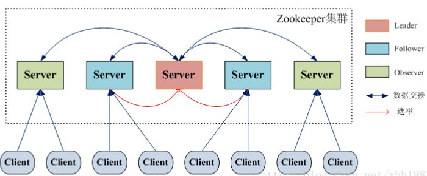

### zookeeper

#### 简介

ZooKeeper 是 Apache 软件基金会的一个软件项目，它为大型分布式计算提供开源的分布式配置服务、同步服务和命名注册。

##### CAP 理论

CAP 理论指出对于一个分布式计算系统来说，不可能同时满足以下三点：

- **一致性**：在分布式环境中，一致性是指数据在多个副本之间是否能够保持一致的特性，等同于所有节点访问同一份最新的数据副本。在一致性的需求下，当一个系统在数据一致的状态下执行更新操作后，应该保证系统的数据仍然处于一致的状态。
- **可用性：**每次请求都能获取到正确的响应，但是不保证获取的数据为最新数据。
- **分区容错性：**分布式系统在遇到任何网络分区故障的时候，仍然需要能够保证对外提供满足一致性和可用性的服务，除非是整个网络环境都发生了故障。

一个分布式系统最多只能同时满足一致性（Consistency）、可用性（Availability）和分区容错性（Partition tolerance）这三项中的两项。

在这三个基本需求中，最多只能同时满足其中的两项，P 是必须的，因此只能在 CP 和 AP 中选择，zookeeper 保证的是 CP，对比 spring cloud 系统中的注册中心 eureka 实现的是 AP。

##### BASE 理论

BASE 是 Basically Available(基本可用)、Soft-state(软状态) 和 Eventually Consistent(最终一致性) 三个短语的缩写。

- **基本可用：**在分布式系统出现故障，允许损失部分可用性（服务降级、页面降级）。
- **软状态：**允许分布式系统出现中间状态。而且中间状态不影响系统的可用性。这里的中间状态是指不同的 data replication（数据备份节点）之间的数据更新可以出现延时的最终一致性。
- **最终一致性：**data replications 经过一段时间达到一致性。

BASE 理论是对 CAP 中的一致性和可用性进行一个权衡的结果，理论的核心思想就是：我们无法做到强一致，但每个应用都可以根据自身的业务特点，采用适当的方式来使系统达到最终一致性。

ZooKeeper 的设计目标是将那些复杂且容易出错的分布式一致性服务封装起来，构成一个高效可靠的原语集，并以一系列简单易用的接口提供给用户使用

ZooKeeper 是一个典型的分布式数据一致性解决方案，分布式应用程序可以基于 ZooKeeper 实现诸如数据发布/订阅、负载均衡、命名服务、分布式协调/通知、集群管理、Master 选举、分布式锁和分布式队列等功能。

Zookeeper 一个最常用的使用场景就是用于担任服务生产者和服务消费者的注册中心。 

- ZooKeeper 本身就是一个分布式程序（只要半数以上节点存活，ZooKeeper 就能正常服务）。
- 为了保证高可用，最好是以集群形态来部署 ZooKeeper，这样只要集群中大部分机器是可用的（能够容忍一定的机器故障），那么 ZooKeeper 本身仍然是可用的。
- ZooKeeper 将数据保存在内存中，这也就保证了 高吞吐量和低延迟（但是内存限制了能够存储的容量不太大，此限制也是保持znode中存储的数据量较小的进一步原因）。
- ZooKeeper 是高性能的。 在“读”多于“写”的应用程序中尤其地高性能，因为“写”会导致所有的服务器间同步状态。（“读”多于“写”是协调服务的典型场景。）
- ZooKeeper有临时节点的概念。 当创建临时节点的客户端会话一直保持活动，瞬时节点就一直存在。而当会话终结时，瞬时节点被删除。持久节点是指一旦这个ZNode被创建了，除非主动进行ZNode的移除操作，否则这个ZNode将一直保存在Zookeeper上。
- ZooKeeper 底层其实只提供了两个功能：①管理（存储、读取）用户程序提交的数据；②为用户程序提交数据节点监听服务。

**会话**

Session 指的是 ZooKeeper 服务器与客户端会话。在 ZooKeeper 中，一个客户端连接是指客户端和服务器之间的一个 TCP 长连接。

客户端启动的时候，首先会与服务器建立一个 TCP 连接，从第一次连接建立开始，客户端会话的生命周期也开始了。通过这个连接，客户端能够通过心跳检测与服务器保持有效的会话，也能够向Zookeeper服务器发送请求并接受响应，同时还能够通过该连接接收来自服务器的Watch事件通知。 

Session的sessionTimeout值用来设置一个客户端会话的超时时间。当由于服务器压力太大、网络故障或是客户端主动断开连接等各种原因导致客户端连接断开时，只要在**`sessionTimeout`**规定的时间内能够重新连接上集群中任意一台服务器，那么之前创建的会话仍然有效。

在为客户端创建会话之前，服务端首先会为每个客户端都分配一个sessionID。由于 sessionID 是 Zookeeper 会话的一个重要标识，许多与会话相关的运行机制都是基于这个 sessionID 的，因此，无论是哪台服务器为客户端分配的 sessionID，都务必保证全局唯一。

**Znode**

在Zookeeper中，“节点”分为两类，

- 第一类同样是指构成集群的机器，称之为机器节点；

- 第二类则是指数据模型中的数据单元，称之为数据节点一一ZNode。

在Zookeeper中，node可以分为持久节点和临时节点两类。

- 持久节点是指一旦这个ZNode被创建了，除非主动进行ZNode的移除操作，否则这个ZNode将一直保存在Zookeeper上。
- 临时节点不一样，它的生命周期和客户端会话绑定，一旦客户端会话失效，那么这个客户端创建的所有临时节点都会被移除。

**版本**

**事件监听器 watcher**

Zookeeper允许用户在指定节点上注册一些Watcher，并且在一些特定事件触发的时候，ZooKeeper服务端会将事件通知到感兴趣的客户端上去，该机制是Zookeeper实现分布式协调服务的重要特性。

**ACL (access control lists)**

权限控制

- create：创建子节点的权限
- read：获取节点数据 和 子节点列表 的权限
- write：更新节点数据的权限
- delete：删除子节点的权限
- admin：设置节点 acl 的权限

特点：

- **顺序一致性：** 从同一客户端发起的事务请求，最终将会严格地按照顺序被应用到 ZooKeeper 中去。
- **原子性：** 所有事务请求的处理结果在整个集群中所有机器上的应用情况是一致的，也就是说，要么整个集群中所有的机器都成功应用了某一个事务，要么都没有应用。
- **单一系统映像 ：** 无论客户端连到哪一个 ZooKeeper 服务器上，其看到的服务端数据模型都是一致的。
- **可靠性：** 一旦一次更改请求被应用，更改的结果就会被持久化，直到被下一次更改覆盖。

**zookeeper设计目标**

1. 简单的数据模型
2. 可构建集群
3. 顺序访问
4. 高性能

#### **集群角色**

- master, slave

- leader, follower, observer

  

Leader 既可以为客户端提供写服务又能提供读服务。

Follower 和 Observer 都只能提供读服务。

Follower 和 Observer 唯一的区别在于，Observer 机器不参与 Leader 的选举过程，也不参与写操作的“过半写成功”策略，

因此 Observer 机器可以在不影响写性能的情况下提升集群的读性能。

#### zab协议  paxos算法

ZAB（ZooKeeper Atomic Broadcast 原子广播） 协议是为分布式协调服务 ZooKeeper 专门设计的一种支持崩溃恢复的原子广播协议。 

在 ZooKeeper 中，主要依赖 ZAB 协议来实现分布式数据一致性，基于该协议，ZooKeeper 实现了一种主备模式的系统架构来保持集群中各个副本之间的数据一致性。

- 崩溃恢复

- 消息广播

当整个服务框架在启动过程中，或是当 Leader 服务器出现网络中断、崩溃退出与重启等异常情况时，ZAB 协议就会进人恢复模式并选举产生新的Leader服务器。当选举产生了新的 Leader 服务器，同时集群中已经有过半的机器与该Leader服务器完成了状态同步之后，ZAB协议就会退出恢复模式。其中，所谓的状态同步是指数据同步，用来保证集群中存在过半的机器能够和Leader服务器的数据状态保持一致。

当集群中已经有过半的Follower服务器完成了和Leader服务器的状态同步，那么整个服务框架就可以进人消息广播模式了。

